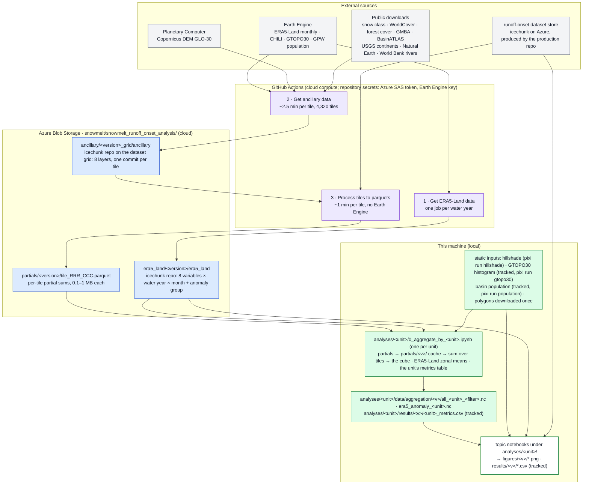

# global_snowmelt_runoff_onset_analysis

Analyses of the [global snowmelt runoff onset dataset](https://doi.org/10.5281/zenodo.16953614)
([Gagliano et al., 2026, *Earth System Science Data*](https://doi.org/10.5194/essd-18-5871-2026)):
a map/reduce pipeline that aggregates the 80 m dataset into per-unit statistics (mountain ranges,
river basins, continents) and the notebooks that analyse them — elevation and aspect structure of
runoff onset, its interannual anomalies, its sensitivity to spring temperature, basin-scale summaries,
a single-range worked example.

Dataset creation, evaluation and the interactive map live in the companion repo
[egagli/global_snowmelt_runoff_onset](https://github.com/egagli/global_snowmelt_runoff_onset), whose
package this one imports for the dataset store, the configuration and the shared plot styling.

## Where things live

Two places hold data. **Cloud** is the Azure Blob Storage container `snowmelt` (account `uwcryo`) under the
prefix `snowmelt_runoff_onset_analysis/`, plus the external services the pipeline reads from (Earth
Engine, Planetary Computer, public downloads). **Local** is this clone. Every local file is either tracked,
downloaded by the code on first use, built by a script in `pipeline/scripts/`, or regenerable from the cloud
products by a notebook; the cloud products are regenerable from the external sources by the three GitHub
Actions workflows.

| | Cloud | Local (this clone) |
| --- | --- | --- |
| **Inputs the pipeline reads** | the runoff-onset dataset store (icechunk, produced by the production repo); ERA5-Land monthly, CHILI, GTOPO30 and GPW population on Earth Engine; Copernicus DEM on Planetary Computer; snow class, WorldCover, forest cover, GMBA, BasinATLAS, USGS continents, Natural Earth, the World Bank rivers as public downloads | `data/global_hillshade_robinson.tif` (`pixi run hillshade`); `analyses/<unit>/data/geometries/` (the unit's polygons, downloaded once) with two small **tracked** tables: the GTOPO30 land histogram and the level-6 basin population; the curated label layout of the two world maps. [data/README.md](data/README.md) lists every one with its rebuild command. |
| **Pipeline products** | `era5_land/<version>/era5_land` (ERA5-Land icechunk repo), `ancillary/<version>_grid/ancillary` (ancillary icechunk repo), `partials/<version>/tile_RRR_CCC.parquet` (per-tile partial sums), optional `parquets/<version>/` (pixel tables) | `partials/<version>/` (the downloaded partials, gitignored); `analyses/<unit>/data/aggregation/<version>/` (the cubes and ERA5 zonal means, gitignored, minutes to rebuild) |
| **Analysis products** | — | `analyses/<unit>/results/<version>/*.csv` and `analyses/<unit>/figures/<version>/*.png`, **tracked** per dataset version (the machine-generated sweeps are gitignored) |

## Setup

The production repo is cloned **side-by-side** (the pixi environment editable-installs it from
`../global_snowmelt_runoff_onset`; `Config` resolves the config file, credentials and tile registries
inside that clone). The workflows and the CI check it out at the commit named in `pixi.toml`.

```bash
git clone https://github.com/egagli/global_snowmelt_runoff_onset.git
git clone https://github.com/egagli/global_snowmelt_runoff_onset_analysis.git
cd global_snowmelt_runoff_onset_analysis
pixi install                # the default environment (pipeline + analysis + jupyter)
pixi run setup-kernel       # registers the 'gsro-analysis (pixi)' jupyter kernel
pixi run setup-nbstripout   # the git filter that strips notebook outputs and the kernelspec
pixi run hillshade          # one-off: builds data/global_hillshade_robinson.tif from Natural Earth (no credentials)
pixi run lab
```

Credentials, all resolved automatically:

| Credential | Needed for | Source |
| --- | --- | --- |
| Azure SAS token | the dataset store and every Azure product (the ancillary and ERA5-Land repos, the partials); the aggregation notebooks run without it on the local partials cache | `../global_snowmelt_runoff_onset/config/sas_token.txt` or `AZURE_STORAGE_SAS_TOKEN`; the workflows use the repository secrets `AZURE_STORAGE_SAS_TOKEN` and `AZURE_STORAGE_ACCOUNT` |
| Earth Engine service key | CHILI (workflow 2), ERA5-Land acquisition (workflow 1), the GTOPO30 histogram and basin population rebuilds, `river_basins/snow_water` | `../global_snowmelt_runoff_onset/config/ee_key.json` via `settings.initialize_earthengine()` (works headless); the workflows use the secret `EE_SERVICE_ACCOUNT_KEY` |
| none | the public multiscale pyramid, every topic notebook (they read the local cubes and tables), the Evan & Eisenman comparison, `pixi run hillshade` | — |

Compute is local or GitHub Actions; there is no cluster service.

## Layout

```text
gsro_analysis/        the package (table below)
pipeline/             scripts/ (the two wave workers, the dispatcher, the ERA5-Land store, the three static-input builders),
                      pipeline.ipynb (state, reset, work list + dispatch, one tile end to end), tile_data/ (the fleet work list);
                      README.md = mechanics
analyses/<unit>/      one folder per aggregation unit (continents, mountain_ranges, river_basins), each with the same shape:
  0_aggregate_by_<unit>.ipynb    the fleet's partial sums -> the unit's cube(s), ERA5-Land zonal means, the unit's metrics table
  <topic>.ipynb                  the analyses (read the cube and the metrics table, write figures)
  data/geometries/               the unit's polygons, downloaded once (gitignored; small tracked tables listed in data/README.md)
  data/aggregation/<version>/    all_<unit>_<filter>.nc, era5_anomaly_<unit>.nc (gitignored, regenerable in minutes)
  results/<version>/             tables (tracked)      figures/<version>/   figures (tracked, sweeps gitignored)
analyses/case_studies/sierra_nevada/, analyses/climate/   the worked example and the ERA5-Land climate notebooks
partials/<version>/   local cache of the fleet's per-tile partial sums (gitignored)
data/                 the shared hillshade basemap and its source zip (gitignored); README.md = every input and its rebuild
docs/                 aggregation_lineage.md: every input from source to analysis, the design notes and decisions
tests/                fixture partials for the credential-free CI smoke test
.github/workflows/    get_era5_land_data.yml, get_ancillary_data.yml, process_tiles.yml (workflow_dispatch), ci.yml
```

**Version discipline.** Every output path names the dataset version it came from (`config.version`,
e.g. `v10`). The version is chosen in one place, `gsro_analysis.settings.CONFIG_FILE` (override per
shell with `GSRO_CONFIG=…`), and every notebook and script builds its `Config` through
`settings.load_config()`. Pixel filters are named predicate sets (`aggregate.FILTERS`: `fcf_lte_50`,
the rule of every analysis, and `full_dataset`), applied in the fleet's map step and recorded in every
file name and attrs. Water years come from `config.water_years`, never literals. `GSRO_PARTIALS_ROOT`
and `GSRO_OUTPUT_ROOT` redirect the partials cache and everything the notebooks write to a test set.

## Pipeline

Three GitHub Actions workflows build the cloud products; one notebook per unit turns them into the cubes and the
metrics table the topic notebooks read. Blue boxes are on Azure, purple ones run on GitHub-hosted runners, green ones
are on this machine.



### The stages

| # | Stage | Runs on | Entry point | Reads | Writes |
| --- | --- | --- | --- | --- | --- |
| 1 | **Get ERA5-Land data** (per version) | GitHub Actions, one job per water year | `get_era5_land_data.yml` → `pipeline/scripts/era5_land.py` | ERA5-Land monthly aggregates on Earth Engine (`ee.data.computePixels`, native 0.1° grid) | **cloud** `era5_land/<version>/era5_land`: ONE icechunk repo, one commit per water year, then the `anomaly` group (each variable minus its per-pixel median over all water years) |
| 2 | **Get ancillary data** (once per grid) | GitHub Actions, ~2.5 min per tile | `get_ancillary_data.yml` → `pipeline/scripts/build_ancillary_batch.py` | Copernicus DEM (Planetary Computer), CHILI (Earth Engine), snow class + WorldCover (`easysnowdata`), forest cover (public blob), GMBA / BasinATLAS level 6 / USGS continents (downloaded once, Actions cache) | **cloud** `ancillary/<version>_grid/ancillary`: ONE icechunk repo on the dataset grid (EPSG:4326, 0.00072°), 8 layers as compact ints, one chunk and one commit per tile |
| 3 | **Process tiles to parquets** (per version) | GitHub Actions, ~1 min per tile | `process_tiles.yml` → `pipeline/scripts/process_tiles_batch.py` | the dataset store's tile window + the ancillary repo's tile window (both **cloud**) | **cloud** `partials/<version>/tile_RRR_CCC.parquet`: partial sums per (filter, unit, bins, CHILI class); `keep_pixels` adds the per-pixel table under `parquets/<version>/` |
| 4 | **Aggregate** (per unit) | local, minutes per unit | `analyses/<unit>/0_aggregate_by_<unit>.ipynb`; `pixi run aggregate` runs all three headlessly | the partials (downloaded once into **local** `partials/<version>/`), the unit's polygons (GMBA + continents from the web, BasinATLAS from the cached gdb), the ERA5-Land anomaly group (**cloud**), the tracked GTOPO30 histogram and level-6 population table | **local** `analyses/<unit>/data/aggregation/<version>/all_<unit>_<filter>.nc` and `era5_anomaly_<unit>.nc`; **local, tracked** `analyses/<unit>/results/<version>/<unit>_metrics.csv` |
| 5 | **Topic notebooks** | local | `analyses/<unit>/*.ipynb` ([analyses/README.md](analyses/README.md)) | the cubes, the metrics tables, the hillshade; the case study and `climate/` also read the store and the ERA5-Land repo (**cloud**) | **local, tracked** `analyses/<unit>/figures/<version>/`, `analyses/<unit>/results/<version>/` |

The two stores are ledgers: a tile or a water year is done when it has a commit, a failed job commits
nothing, and each plan job folds the commit history to list what remains (the production repo's
icechunk fleet pattern). Every statistic the analyses read is reducible (means, standard deviations and
correlations from sums), so a tile job emits sums instead of a pixel table and the reduce is a laptop
job. The map keys every unit type by the finest axes it will ever need (basins at HydroBASINS level 6,
continents by latitude × elevation × aspect); the aggregation notebooks derive the coarser default cubes
(level-5 basins, latitude × elevation continents) exactly, and the finer ones on request. Tabulating on the
UTM grid keeps every row a ~6,400 m² pixel, so pixel counts are area without weights. Mechanics, ledgers,
what a partials row is, sizing, redo recipes: [pipeline/README.md](pipeline/README.md). Lineage of
every input from source to analysis: [docs/aggregation_lineage.md](docs/aggregation_lineage.md).

### Every input, where it lives, how it gets there

| Input | Lives | How it gets there | Credentials |
| --- | --- | --- | --- |
| Runoff-onset dataset (v10 icechunk store) | cloud, the production repo's store | produced by the production repo | SAS token |
| ERA5-Land monthly (8 variables) | Earth Engine → cloud `era5_land/<version>/era5_land` | workflow 1 | Earth Engine key, SAS token |
| Copernicus DEM GLO-30 | Planetary Computer STAC | fetched per tile by workflow 2 | none |
| CHILI (insolation index) | Earth Engine | fetched per tile by workflow 2 on its native lattice | Earth Engine key |
| Seasonal snow class (Sturm & Liston 2021), ESA WorldCover | public, via `easysnowdata` | fetched per tile by workflow 2 | none |
| Forest cover fraction (PROBA-V LC100) | public blob (`settings.FOREST_COVER_FRACTION_URL`) | fetched per tile by workflow 2; the case study reads it too | none |
| GMBA v2 standard 300, USGS continents | public downloads | the notebooks read them straight from the web (`gpd.read_file('zip+' + url)`); the fleet caches them under `analyses/<unit>/data/geometries/` (Actions cache on the runners) | none |
| BasinATLAS v1.0 (HydroBASINS levels 1–12) | public download → **local** `analyses/river_basins/data/geometries/` (2.7 GB, md5-checked) | `settings.basin_atlas_gdb()` on first use; the one vector source that must be cached (figshare bot challenge, gdb not streamable) | none |
| GTOPO30 land histogram | **local, tracked** `analyses/continents/data/gtopo30_lat_elev_histogram.nc` | `pixi run gtopo30` rebuilds it from Earth Engine (identical to the tracked file) | Earth Engine key (rebuild only) |
| HydroBASINS level-6 population | **local, tracked** `analyses/river_basins/data/geometries/hydrobasins_level6_population.csv` | `pixi run population` sums GPW v4.11 per basin on Earth Engine; level 5 is the exact prefix sum | Earth Engine key (rebuild only) |
| Hillshade basemap | **local** `data/global_hillshade_robinson.tif` | `pixi run hillshade` (Natural Earth → World Robinson 1 km) | none |
| Major rivers overlay | World Bank *Major Rivers of the World* | read straight from the web by the basin notebook | none |
| SNOTEL/CCSS daily archive, WeatherBench2 ERA5 climatology | **local** `analyses/climate/temperature_sensitivity_comparison/data/` | self-downloaded by the Evan & Eisenman notebook on first run | none |
| NOAA PSL teleconnection indices | read live by `mountain_ranges/teleconnections.ipynb` | — | none |
| Fleet work list | **local, tracked** `pipeline/tile_data/ancillary_tiles_v10.txt` | `pipeline/pipeline.ipynb` from the store's commit history | SAS token |
| Label layout of the two world maps | **local, tracked** `analyses/mountain_ranges/label_layout.csv` | curated by hand (the one input that is neither data nor code) | — |

### The aggregate schema

One schema for every unit type (`aggregate.UNIT_TYPES` = the map keys, `aggregate.GROUPS` = the cubes):

| cube | dims | extras merged by the aggregation notebook |
| --- | --- | --- |
| `mountain_ranges` | `mountain_range × elevation(100 m) × aspect(15°) × chili_class × water_year` | GMBA_V2_ID, centroid, continent; ERA5-Land anomaly zonal means `(range, water_year, month)` |
| `river_basins` (HydroBASINS level 5, derived from the stored level-6 ids) | `river_basin × elevation × chili_class × water_year` | ERA5-Land zonal means `(basin, water_year, month)` |
| `continents` | `continent × latitude(1°) × elevation × chili_class × water_year` | `dem_pixel_count` (GTOPO30 land histogram) |
| on request: `river_basins_l6`, `continents_aspect` | level-6 basins; `continent × latitude × elevation × aspect × …` | as above |

Variables: `runoff_onset_median`, `runoff_onset_mad`, `temporal_resolution_median` (static),
`runoff_onset`, `runoff_onset_anomaly` (per water year), each as the bin **mean** with `<var>_std` and
`<var>_n`; `n_years`; `chili_corr`, `fcf_corr`. Nothing is precomputed: whole-basin means, elevation
profiles and range mean anomalies are `aggregate.weighted_mean(ds, var, dims)`; `aggregate.collapse`
folds the CHILI axis exactly; `aggregate.threshold` masks thin bins. The analyses' masking rules are
written out in the notebooks themselves (the same block at the top of every mountain-range notebook).

## Running a dataset version

1. **1. Get ERA5-Land data** (the Actions tab lists the three workflows in this order): no inputs needed; it
   creates the version's store if missing, fetches only the water years without a commit, then builds the
   anomaly group (`start_fresh` deletes the store first).
2. **2. Get ancillary data**: creates the grid generation's ancillary store if missing and builds every tile
   without a commit (`start_fresh` deletes the store first). Re-dispatch until the plan job reports 0.
3. **3. Process tiles to parquets**: maps every tile that has an ancillary commit and no partials blob
   (`start_fresh` deletes the partials and pixel tables first). Re-dispatch until 0 remaining. Each job
   logs one line per step per tile.
4. **Aggregate**: run `analyses/<unit>/0_aggregate_by_<unit>.ipynb` for each unit (or `pixi run aggregate`).
   Each downloads the partials it is missing, sums them, writes the unit's cubes and zonal means, and its
   metrics table.
5. **Notebooks**: see [analyses/README.md](analyses/README.md); the two composite world maps build their
   own inset sweeps; `pixi run hillshade` once beforehand for their basemap.

`pipeline/pipeline.ipynb` has a cell for each step (state, reset, work list, dispatch, one tile end to
end). To redo a tile, delete its partials blob and re-dispatch wave 3; recommitting a tile in wave 2
supersedes its ancillary. A change of a unit definition alone is `datacube.refresh_unit_layers` (one
commit per tile, no Earth Engine) plus a re-map.

## The `gsro_analysis` package

The package holds the pipeline engine and the math; everything a reader of a notebook needs to follow is a
visible cell (every read an explicit `xr.open_dataset` / `pd.read_csv` / `gpd.read_file`, every masking rule
and regression written out).

| Module | Contents |
| --- | --- |
| [paths.py](gsro_analysis/paths.py) | version-aware, repo-root-anchored paths: `geometries`, `aggregation_dir`, `figdir`, `resultsdir`, `partials_cache`, `gtopo30_histogram`, `hillshade`; the two environment overrides |
| [settings.py](gsro_analysis/settings.py) | the one place the dataset version is chosen; Azure prefixes; external source URLs and Earth Engine asset ids; Earth Engine init; `cached_source` and the three vector-source caches of the fleet |
| [ledger.py](gsro_analysis/ledger.py) | the icechunk ledger shared by the two stores: storage handles, `commit_with_retry`, the ancestry fold `commit_records` |
| [datacube.py](gsro_analysis/datacube.py) | the ancillary store on the dataset grid (`initialize_ancillary_store`, `build_ancillary_window`, `write_ancillary_tile`, `open_ancillary_window`, `refresh_unit_layers`), the UTM process step (`tabulate_tile`, `process_tile`), partials/pixel-table writers, `reset_version` (dry run by default) |
| [aggregate.py](gsro_analysis/aggregate.py) | `FILTERS`, `UNIT_TYPES`, `GROUPS`; the map `tile_partials` and the reduce math `reduce_partials`; `sync_partials`; the read-side helpers `weighted_mean`, `collapse`, `threshold`, `elevation_relative` |
| [era5.py](gsro_analysis/era5.py) | the ERA5-Land icechunk store: template, native-grid acquisition (`acquire_water_year`), commit ledger (`status`), `build_anomaly`, `open_era5_land`, `open_anomaly`, the zonal join `zonal_anomalies` |
| [results.py](gsro_analysis/results.py) | `provenance(config)`: the four stamp columns of every results table |
| [plotting.py](gsro_analysis/plotting.py), [colorbars.py](gsro_analysis/colorbars.py) | `style_polar_axes` and the per-range polar anomaly grid; annotated colorbars as presets over the production `plot_utils` |
| [world_maps.py](gsro_analysis/world_maps.py) | the two inset world maps (page model in mm, label blocks from `analyses/mountain_ranges/label_layout.csv`, choropleth ramps, `layout_report`) |

## Conventions

Every read is a visible open with the variable displayed in the same cell, names carry the object type
(`_ds`, `_da`, `_df`, `_gdf`), one operation per cell with its constants named, no `plt.show()`, an explicit
`savefig` path for every figure. Every quoted number exists in a `results/<version>/` table stamped with
`_version`, `_git_sha` (production package), `_analysis_git_sha` (this repo) and `_written_at`; figures are
PNG at ≤ 300 dpi, one tracked set per dataset version, sweeps gitignored; figure styling follows the production
`plot_utils` conventions; notebook outputs and kernelspecs are stripped by `nbstripout`. Nothing on Azure is
deleted by the code except `datacube.reset_version`, which is a dry run until confirmed.

**Possible future step.** The cubes and zonal means (~160 MB per version) exist only locally and on the
SAS-protected Azure account, so a stranger can run the pipeline but not skip it. Publishing them per
version as a Zenodo record would let every topic notebook run with no credentials at all.

## Sibling repos

Two private companions, needed for nothing here:
[egagli/global_snowmelt_runoff_onset_paper](https://github.com/egagli/global_snowmelt_runoff_onset_paper)
holds the notes, history and writing behind these analyses and the provenance of the frozen `v9` renders;
[egagli/recreate_global_snowmelt_runoff_onset_analysis_QGIS_figures_in_mpl](https://github.com/egagli/recreate_global_snowmelt_runoff_onset_analysis_QGIS_figures_in_mpl)
holds the QGIS project the two inset world maps were transferred from and the sweeps their published renders embedded.

**In this repository, I've used Claude Code to reorganize, streamline, and reimplement my initial global analysis (carried out in chapters 4-5 of my [PhD dissertation](https://digital.lib.washington.edu/researchworks/items/857905b7-12e7-45a0-9792-f710f46b169c)) of the [global_snowmelt_runoff_onset](https://github.com/egagli/global_snowmelt_runoff_onset) dataset.**

License: MIT (`LICENSE`). When using these analyses, cite the dataset publication (`CITATION.cff`):

> Gagliano, E., Shean, D., and Henderson, S.: A global high-resolution dataset of snowmelt runoff onset
> timing from Sentinel-1 SAR, 2015–2024, Earth Syst. Sci. Data, 18, 5871–5894,
> <https://doi.org/10.5194/essd-18-5871-2026>, 2026.
