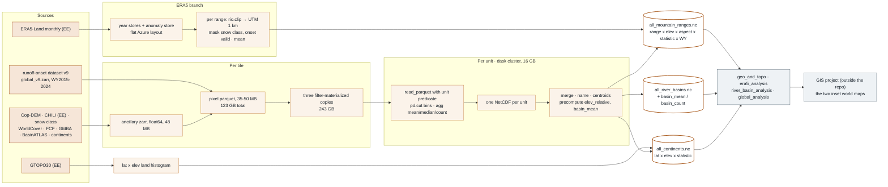
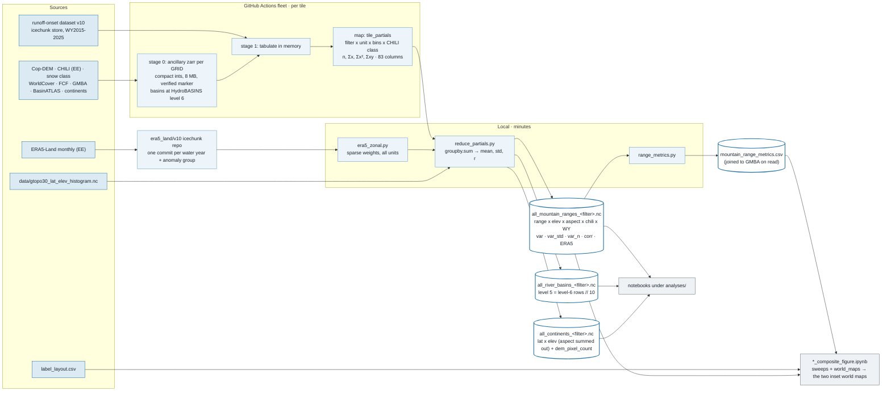

# Aggregation lineage: every input, source to analysis

How each input to the per-unit aggregates ("cubes") travels from its source through the
intermediates it becomes, the mechanism that aggregates it, the structure it ends up in, and
the analysis that reads it. Two workflows are described: the one that produced the frozen v9
cubes in 2025 (retired 2026-08-26) and the map/reduce pipeline that replaced it and produces v10.
Mechanics of the current pipeline (ledgers, fleet sizing, redo recipes) are in
[pipeline/README.md](../pipeline/README.md). Written 2026-09-02; the decisions at the end were
implemented on 2026-09-03 (HydroBASINS level 6 stored, level 5 derived; the continents aspect key;
two filter tags).

## The two workflows at a glance

*Original workflow (v9). Rust: retired.*

*Modified workflow (v10). Blue: current.*

## Original workflow (v9, 2025; retired 2026-08-26)

Pixels were tabulated per tile into large parquet tables, copied three times pre-filtered, and
each geographic unit was then aggregated on its own by a dask job that pulled that unit's rows
out of ~4,000 files. Every bin stored the mean, median and count of the pixel values along a
`statistic` axis; the marginals the notebooks wanted were precomputed and stored. Stage 2 needed
a 16 GB machine (a cloud dask cluster in 2025), and each unit type had its own code path. The
code's last form before the redesign is `gsro_analysis/aggregate.py` at commit `f431270`
(`process_and_save_geographic_unit`, `create_lat_and_elev_binned_ds`,
`add_era5_anomaly_to_mountain_ranges`).

| Input | Source | Intermediates | Aggregation mechanism | Output structure | Read by |
| --- | --- | --- | --- | --- | --- |
| Runoff onset per pixel | v9 store (80 m, WY2015–2024): `runoff_onset` per year, `runoff_onset_median`, `runoff_onset_mad`, `temporal_resolution_median` | tile window reprojected bilinearly onto the tile's UTM ancillary grid → pixel table (one row per pixel with a valid median; ints with −9999, floats NaN; an index column) → parquet on Azure (`analysis/parquets/tiles/v9`, 4,445 files, 123 GB) → three copies re-read and rewritten with a filter applied (`analysis/parquets/full_datasets/<filter>/v9`, 243 GB) | per unit: `dd.read_parquet` of the filtered copy with a unit-id predicate; `pd.cut` into 100 m elevation and 15° aspect bins (`(left, right]`, so 0 m pixels dropped); `groupby.agg(['mean','median','count'])` of median, MAD, each year's onset and anomaly (onset − pixel median); results written into a dense array cell by cell | dims `elevation(90) × aspect(24) × statistic(3) × water_year(10)`; variables `runoff_onset_median`, `runoff_onset_mad`, `runoff_onset`, `runoff_onset_anomaly`; precomputed `runoff_onset_elev_relative`; attrs `location`, `unit_type` only | triplets, lapse rates, MAD and anomaly panels selected `statistic='mean'` and `'count'`; the `median` statistic was never read |
| Terrain | Copernicus DEM GLO-30 via Planetary Computer STAC | UTM 80 m per tile; slope and aspect from `xdem`; float64 layers in the ancillary zarr (~48 MB/tile) | elevation and aspect are the bin axes; slope carried, unused | bin-centre coordinates | everything binned |
| CHILI (insolation) | Earth Engine via `easysnowdata` | float64 ancillary layer; pixel column | continents only: thresholds 0.448 / 0.767 → separate `chili_cool/neutral/warm` mean-of-median variables (pixels without CHILI counted as neutral); per-bin Pearson r via a dask `groupby.apply(corr)` | continents-cube variables per lat × elev bin | `global_analysis` sunny–shaded panels |
| Snow class, WorldCover, forest cover | `easysnowdata` (seasonal snow classification, ESA WorldCover); FCF from the uwcryo mirror | ancillary layers → pixel columns | filters (`snow_classification ≠ 4`, `WorldCover ∉ {50, 80}`, `0 ≤ fcf ≤ 50`), first by materializing filtered copies, later (Aug 2026) as read-time parquet predicates; FCF correlated with the median per continent bin with the −9999 fill mixed in | baked in: the filename says `fcf_lte_50`, nothing else records it | all notebooks implicitly |
| Unit membership | GMBA v2 standard 300 (`GMBA_V2_ID`), BasinATLAS level 5 (`PFAF_ID`), USGS continents | rasterized per tile with `geocube` → integer id layers | unit predicate of the per-unit scan; merged NetCDFs named by `MapName` (`Level_04` for the three Andes cordilleras); centroid lat/lon and continent added as coordinates; Australia folded into Oceania | `mountain_range` (179 in v9), `river_basin`, `continent` dims | range names; display-range lists |
| Basin marginals | the basin cube | — | `basin_weighted_means`: count-weighted mean over elevation × aspect stored as two more `statistic` values | `basin_mean`, `basin_count` (3.76 GB file, 93 % NaN) | the only thing `river_basin_analysis` read |
| ERA5-Land anomalies | ERA5-Land monthly via Earth Engine (8 variables, 9 hemisphere-aware months) | per-water-year zarr stores + anomaly store (vs the median over the base years) in a flat Azure layout; Equal-Earth stacks for maps | per range, sequentially: `rio.clip` to the polygon, reproject to UTM 1 km, mask to snow class ≠ 4 and onset-valid pixels of a coarsened onset store, spatial mean (~30 s per range; a skip list for broken geometries) | 8 variables on `(mountain_range, water_year, month)` merged into the range cube | `era5_analysis`: spring-month means → OLS sensitivity per range; the scatter sweep; the GMBA stats geojson built inside the notebook |
| Land area reference | GTOPO30 via Earth Engine | — | `reduceRegion` histogram of land pixels per 1° latitude × 100 m elevation per continent | `dem_pixel_count` in the continents cube | normalising the lat × elev panels |

Downstream of the cubes: `geo_and_topo_analysis.ipynb`, `era5_analysis.ipynb`,
`river_basin_analysis.ipynb`, `global_analysis.ipynb` (split by topic on 2026-08-26), then a GIS
project outside the repository for the two world maps. The v9 cubes on disk today
(`aggregated_results/v9/`) are this schema and are reference copies only.

## Modified workflow (map/reduce, 2026-08-26; produces v10)

The insight behind the redesign: every statistic the analyses read is reducible from sums, and
no notebook ever read a bin median. So the fleet job that tabulates a tile also emits that
tile's partial sums for every cell of the final cube, and the reduce is a pandas `groupby.sum`
that runs in minutes on a laptop. One schema, one pass, for all three unit types and all three
filters. Validated 2026-08-26 on the five v10 dry-run tiles: the reduce reproduces an
independent pandas computation to float32 precision; the ERA5 zonal join matches the old clip
method to 0.01–0.06 K mean absolute difference.

| Input | Source | Intermediates | Aggregation mechanism | Output structure | Read by |
| --- | --- | --- | --- | --- | --- |
| Runoff onset per pixel | v10 icechunk store (extended grid, WY2015–2025), read per tile window with CF decoding | reprojected bilinearly onto the stored ancillary grid; tabulated **in memory** (same columns as before); the pixel parquet is opt-in (`--keep-pixels`) and nothing downstream reads it | `aggregate.tile_partials`: per filter tag × unit type, keys (unit id, elevation bin, aspect or latitude bin, CHILI class) factorized once; `np.bincount` sums per key: `n, Σmedian, Σmedian²`, `n/Σ/Σ²` MAD, Σ temporal resolution, Σ valid-year count, and per water year `n, Σonset, Σonset², Σanomaly, Σanomaly²` (85 columns) → one partials parquet per tile (0.1–1 MB). `reduce_partials`: `groupby(keys).sum` over all tiles → mean = Σx/n, std = √(Σx²/n − mean²) | dims `unit × bins × chili_class(4) × water_year`; variables `<var>`, `<var>_std`, `<var>_n` for median, MAD, onset, anomaly; `temporal_resolution_median`, `n_years`; float32 means, int32 counts; attrs record `filter_tag`, the predicates, the class thresholds and the statistic definitions | `aggregate.open_aggregate` → `stats.prepare_mountain_ranges` (exact CHILI collapse, n > 100, 30 % year rule, tropical-Andes rule, `elev_relative` and range mean anomaly computed on read); `weighted_mean`, `threshold` everywhere else |
| Terrain | Copernicus DEM GLO-30 (Planetary Computer) | compact integer layers in the per-grid ancillary zarr (~8 MB/tile, built once per grid, reused across dataset versions); lat/lon recomputed from UTM x/y | half-open bins `[left, right)`: 100 m elevation 0–9000, 15° aspect with 360° wrapped to north (ranges and, since 2026-09-03, continents — flat pixels keep an undefined aspect there), 1° latitude over the whole globe for continents; the default continents cube sums the aspect out, `continents_aspect` keeps it | bin-centre coordinates with `bin_edges` in attrs | everything binned |
| CHILI (insolation) | Earth Engine via `easysnowdata` | ancillary layer (uint16, scaled); pixel column | a cube **dimension** for every unit type: cool / neutral / warm / none (no CHILI value); pixel-level Pearson r of CHILI vs the pixel median per geometric bin from six sums (`n ≥ 3`), summed over classes | `chili_class` axis; `chili_corr`, `chili_corr_n` | `aggregate.collapse` folds the axis exactly for the range analyses; `global/sunny_shaded` reads the classes |
| Snow class, WorldCover, forest cover | as before (FCF mirror on uwcryo) | ancillary layers; pixel columns | named predicate sets `aggregate.FILTERS` applied in the map, both tags (`fcf_lte_50`, `full_dataset`) emitted in the same pass; FCF correlation only over pixels with FCF coverage | one cube per (unit type, filter tag), filter recorded in filename and attrs; `fcf_corr`, `fcf_corr_n` | notebooks open `fcf_lte_50` (the analyses' rule) explicitly |
| Unit membership | GMBA v2, BasinATLAS **lev06** (since 2026-09-03; lev05 before), USGS continents, downloaded once into `data/geometries/sources/` | integer id layers in the ancillary (`GMBA_V2_ID` int32, `PFAF_ID` int32 six-digit, `continent` int8), rasterized with `geocube` at 0.0003° and mode-resampled onto the 80 m grid; `datacube.refresh_unit_layers` rewrites them in place | part of the map key; the reduce derives the level-5 basin id (`PFAF_ID // 10`) for the default `river_basins` cube, names ranges (`MapName` / `Level_04`), adds centroids and continent, names continents (Australia → Oceania) on a fixed six-continent axis so partial versions still run | `mountain_range`, `river_basin`, `continent` dimensions | range names; display-range lists filtered to what exists |
| Marginals | the cubes themselves | — | not stored: `weighted_mean(ds, var, dims)` (count-weighted, exact), `collapse`, `threshold`, `elevation_relative` at read time | — | basin means for the choropleths, range mean anomalies, elevation profiles |
| ERA5-Land anomalies | ERA5-Land monthly via Earth Engine (`ERA5 Acquire` workflow, one job per water year, `ee.data.computePixels` on the native 0.1° grid) | one icechunk repository `era5_land/<version>/era5_land`: the 8 variables on `(water_year, month, latitude, longitude)`, one commit per water year, plus the `anomaly` group (minus the per-pixel median over all water years; base period in attrs and commit metadata); the commit history is the ledger; Equal-Earth products derived on the fly | `era5.zonal_anomalies`: a sparse coverage matrix (polygon fraction per 0.1° cell, 5 × 5 subcells) times per-year cell weights (seasonal-snow fraction × onset validity from the public pyramid) → weighted zonal mean per unit, variable, water year and month, for all units in one streamed pass (~4 min for 289 ranges, ~3.5 min for the 16,341 level-6 basins); cells under 0.25 total weight → NaN | `aggregated_results/<v>/era5_zonal/era5_anomaly_<unit_type>.nc` on `(unit, water_year, month)` plus `zonal_weight`; merged into the range and basin cubes by the reduce; `stats.seasonal_means` adds `spring_months_mean` etc. on read | `range_metrics.py` (OLS + Theil–Sen sensitivity per range → the metrics table); `temperature_sensitivity.ipynb`; the per-range scatter sweep of the temperature-sensitivity world map |
| Land area reference | GTOPO30 histogram, seeded from the v9 file and tracked as `data/gtopo30_lat_elev_histogram.nc` (40 KB); `reduce_partials.py --build-gtopo30` regenerates it via Earth Engine | — | merged by the reduce | `dem_pixel_count` in the continents cube | `global/lat_elev_binning` |
| Curated label layout | `analyses/mountain_ranges/label_layout.csv` (45 rows: display flags, per-map anchors in Robinson metres) | — | joined on read by `world_maps.prepare` to the metrics table + GMBA polygons (`stats.range_metrics_gdf`) | which 40 / 30 ranges get an inset and where | the two composite-figure notebooks |

Downstream: the topic notebooks under `analyses/` (`global/`, `mountain_ranges/`,
`river_basins/`, the Sierra Nevada case study, which reads the store directly),
`pipeline/scripts/range_metrics.py` feeding the provenance-stamped metrics table, and the two
composite notebooks driving `gsro_analysis/world_maps.py`. Cost: ~0.1–1 MB of partials per tile
(2–4 GB per version), a reduce of minutes and under 1 GB, no filter copies, no pixel tables
unless asked for.

## What changed, input by input

| Aspect | Original (v9) | Modified (v10) | Consequence for the analyses |
| --- | --- | --- | --- |
| Statistics per bin | mean, median, count along a `statistic` axis | `<var>` (mean), `<var>_std`, `<var>_n`; bin medians dropped | same numbers the notebooks used; std is new; nothing ever selected `'median'` |
| CHILI | baked in (continents only; no-CHILI pixels counted neutral) | an axis on every unit type with a `none` class | ranges and basins can be split by insolation; `collapse` recovers the old view exactly |
| Filters | three materialized copies of the pixel table (243 GB), later read-time predicates | predicates applied in the map; all tags in one pass; recorded in attrs | every file says what rule produced it |
| Marginals | stored (`basin_mean`, `elev_relative`) | functions at read time | no stale precomputes; exact count-weighted means |
| Bin edges | `pd.cut`, `(left, right]`; 0 m pixels dropped | half-open `[left, right)`; aspect 360 → 0 | edge pixels move one bin; documented in `aggregate.py` |
| ERA5 zonal means | per-range clip and reproject, ~30 s each, sequential, skip list | one sparse weighted pass for all units | basins get ERA5 too; same semantics expressed as weights |
| Compute | dask scan of ~4,000 parquets per unit on a 16 GB cluster | fleet map (~2.5 min/tile) + pandas reduce on a laptop | stage 2 reruns in minutes after any fleet change |
| Per-range numbers | computed inside `era5_analysis.ipynb`, geojson written by the notebook | `range_metrics.py` → one provenance-stamped CSV, joined to the GMBA polygons on read; notebooks only plot | quoted numbers carry two git SHAs (production package, this repo) |
| The two world maps | a GIS project outside the repository over notebook-made insets | `world_maps.py` + two composite notebooks + `label_layout.csv` | reproducible from the repo on any platform |

### Why there is no v9 cube in the new schema

The current readers need `<var>_n` and friends (`stats.prepare_mountain_ranges` fails on the v9
file with `KeyError: 'runoff_onset_median_n'`). The old cube cannot be converted losslessly (no
std, no CHILI split, different bin edges), and the faithful route, re-mapping the 123 GB of v9
pixel tables through `tile_partials` (`datacube.partials_from_pixel_table`), has not been run
because the analyses target v10. The v9 composite maps exist only because the 2026-08-25 sweeps
and stats geojson were made by the old notebooks the day before the switch. A ~30-line read shim
mapping the old `mean`/`count` onto `<var>`/`<var>_n` would make the old file readable for the
mean-based analyses (std and correlations missing) if a v9 rerun ever matters.

## Design note: aggregating at other unit levels later (2026-09-02; decided the same day: store level 6; implemented 2026-09-03)

Question raised by Eric: can another river-basin aggregation (a different HydroBASINS level, or
US HUC units) be added without recomputing much, and can the pipeline be set up now so that it
can?

**Where the unit is fixed today.** Unit membership is decided once per grid in stage 0:
`datacube.add_mountain_range_and_basin_and_continent` rasterizes GMBA v2 (`GMBA_V2_ID`),
BasinATLAS **level 5** (`PFAF_ID`, `settings.BASIN_ATLAS_LAYER`) and the USGS continents into
integer layers of the ancillary zarr. The map keys partial sums by those ids
(`aggregate.UNIT_TYPES`: `id_col`, `unit_dim`, bins), and the reduce sums per key. Changing the
level after the campaign therefore means a fleet pass to add a layer to every ancillary tile
(geocube only, no Earth Engine, ~30 s/tile) **plus** a re-map pass (stage 1 reads the store
window again, ~2.5 min/tile, because pixel tables are not kept): a campaign, not a laptop job.
`era5_zonal.py` and `stats.basin_summary` are also written for level-5 polygons.

**The cheap route: key the partials by the finest unit you will ever want; derive coarser
levels at reduce time.** Pfafstetter codes are hierarchical by digit prefix: a HydroBASINS
level-k `PFAF_ID` has k digits, and the level-j code (j < k) is the first j digits, i.e.
`pfaf // 10**(k - j)`. If the pixel carries the level-8 code, levels 1–8 are all a
`groupby` on the existing partials, minutes with no fleet. USGS Watershed Boundary Dataset codes
work the same way (HUC12 → HUC2…HUC10 by prefix) but are a separate, CONUS-only hierarchy and
would be a second id layer. GMBA is not digit-hierarchical, but its attribute table
(`Level_01…Level_10`) is a many-to-one mapping, so storing the finest polygon id and mapping at
reduce time works there too.

**Costs of finer keys.** Partial rows per tile scale with (units touching the tile) × elevation
bins × 4 CHILI classes (basins bin by elevation only). Approximate global HydroBASINS counts:
level 5 ≈ 4,700 basins (today), level 6 ≈ 16,000, level 7 ≈ 58,000, level 8 ≈ 190,000, level 12
≈ 1,000,000. At level 8 a tile touches on the order of 50–150 basins → ~5–15k basin rows ×
85 columns ≈ 4–12 MB/tile, i.e. 15–50 GB of partials for the campaign instead of 2–4 GB; still
a laptop reduce, but the dense cube `reduce_partials` builds (`basins × 90 × 4 × 11` per yearly
variable) would be ~3 GB per variable at level 8 unless restricted to basins with data or
written sparse/long for fine levels. Level 12 is out of range for the current layout (int32
`PFAF_ID` holds at most 9 digits; rows and cube size explode). ERA5 zonal means are computed per
polygon from the anomaly store, not from partials; coarser levels can be derived exactly from
finer ones because the output carries `zonal_weight` (Σ w·x / Σ w), or `era5_zonal.py` can be
rerun for the new polygons (minutes at level 5, longer at level 8). Caveat measured 2026-09-03: weighting
level-6 children up to level 5 by `zonal_weight` is NOT exactly the level-5 zonal mean (median 0.06 K,
max 0.96 K on the dry-run basins) because cells where ERA5-Land is NaN enter the weight but not the mean;
rerunning `era5_zonal.py` on the coarser polygons is the exact route.

**Proposal (Eric's decision, ideally before the v10 stage 0 runs for 4,320 tiles):**

1. Store `PFAF_ID` at HydroBASINS level 7 or 8 instead of level 5 (fits int32). Keep the
   `river_basins` unit type producing level 5 by prefix so nothing downstream changes; add
   `derive`-style entries to `UNIT_TYPES` (e.g. `id // 10**(k-3)` for level 3) that the reduce
   emits on demand.
2. Optionally add a `HUC12` layer (WBD, CONUS, int64) as a second hydrologic key for US
   comparisons.
3. Leave GMBA as the standard-300 inventory the analyses use; if sub-range analyses are wanted,
   store the GMBA basic-inventory polygon id and map to levels via the attribute table.
4. Give `reduce_partials` a sparse/long output path for fine levels and keep the dense cube for
   the levels the notebooks read.
5. `--keep-pixels` for a region if pixel-level flexibility beyond any planned unit matters.

**Decision (Eric, 2026-09-02): store HydroBASINS level 6.** `settings.BASIN_ATLAS_LAYER` becomes
`BasinATLAS_v10_lev06` (the cached gdb ships lev01–lev12; level 6 ≈ 16,000 basins, six-digit `PFAF_ID`,
int32 unchanged). The map keys basin partials by the level-6 id; the reduce derives level 5 by
`PFAF_ID // 10` for the default `river_basins` group, so every notebook, `era5_zonal.py` (lev05
polygons), `stats.basin_summary` and the level-5 population join stay as they are, and any level
j ≤ 6 is `PFAF_ID // 10**(6 - j)`. A level-6 cube is an on-demand group (`--groups river_basins_l6`,
with `era5_zonal.py` rerun on the lev06 layer for its ERA5 merge). Basin rows per tile grow about
threefold; still a laptop reduce. HUC12 is not added. Finer than level 6 stays the fallback below.
**Implemented 2026-09-03:** `settings.BASIN_ATLAS_LAYER = BasinATLAS_v10_lev06`, `aggregate.GROUPS`
(`river_basins` = level 5 via `basin_level_ids`, `river_basins_l6` on demand), `era5_zonal.py --units
river_basins_l6`; the five dry-run tiles were re-keyed in place (`datacube.refresh_unit_layers`) and
re-mapped; the level-6 ids reduce to the old level-5 ids on 100 % of basin pixels and the reduce
reproduces an independent pandas recomputation for every group.

If the campaign has already run when this is decided, the fallback is the "stage 0b + re-map"
fleet pass described above; the ancillary layers other than the ids are untouched and no Earth
Engine work recurs.

## Design note: CHILI scope (2026-09-02; decided the same day: A, keep everywhere; unchanged in the code)

Question raised by Eric: keep CHILI at all? It matters for continents; do the other unit types
need it?

**Where it is and what it costs.** CHILI (the continuous heat-insolation load index) is the one
Earth Engine layer of stage 0 (`easysnowdata.get_chili`), stored per grid in the ancillary. In
the map it becomes the fourth key of every partials row (cool / neutral / warm / none), so it
multiplies partial rows and the dense cube by up to 4: still 0.1–1 MB per tile and, for the
range cube, ~68 MB per yearly variable (179 × 90 × 24 × 4 × 11 × 4 B). Two pixel-level
correlation columns (`chili_corr`, `fcf_corr`) ride along for every unit type.

**Who reads it today.** Continents only: `global/lat_elev_binning` (warm − cool onset difference
and ratio per latitude × elevation bin), `global/sunny_shaded` (seasonal modulation),
`global/lapse_rates`, and `chili_corr`. Ranges and basins collapse the axis on read
(`stats.prepare_mountain_ranges`, `stats.basin_summary`); no range- or basin-level analysis uses
CHILI yet. Aspect already carries most of the insolation signal for ranges, but CHILI integrates
slope and horizon shading that aspect alone does not.

| Option | Saves | Forecloses |
| --- | --- | --- |
| A. Keep as is: CHILI axis on all three unit types | nothing | nothing; the axis collapses exactly on read |
| B. CHILI axis for continents only; collapse it in the map for ranges and basins | ~4× partial rows and cube size for ranges and basins (both already small) | "sunny vs shaded per range / basin / year" without a re-map |
| C. Drop CHILI entirely | the only Earth Engine dependency of the fleet's stage 0 | the sunny–shaded panel of `lat_elev_binning.ipynb`, `sunny_shaded.ipynb`, `chili_corr` |

The asymmetry decides it: dropping later is a `collapse` (free), adding later is a fleet re-map
and, if the layer was never built, the Earth Engine campaign. Recommendation: A unless the Earth
Engine step becomes the operational blocker; B is the compromise if partials size at a finer
basin level (previous note) becomes a concern.

**Decision (Eric, 2026-09-02): A.** CHILI stays the fourth partials key on all three unit types.

## Dimension audit: what each cube can and cannot answer (2026-09-02)

| Unit type | Dimensions | Per-year variables | Supported questions | Not supported without new sums |
| --- | --- | --- | --- | --- |
| Mountain ranges | `mountain_range × elevation × aspect × chili_class × water_year`; ERA5 on `(range, water_year, month)` | `runoff_onset`, `runoff_onset_anomaly` (each with `_std`, `_n`) | static triplets; **lapse rate per water year** (weighted regression of `runoff_onset.sel(water_year=y)` on elevation, weights `runoff_onset_n`) and its interannual spread; **aspect control per water year** (south − north bin means per elevation per year); whether an anomaly has an elevation gradient in a given year (warm springs hitting low elevations first); range mean anomaly vs ERA5 anomalies by month; sunny − shaded per range and year (if CHILI kept) | aspect × CHILI interactions below bin resolution; anything about the distribution inside a bin beyond mean and std |
| River basins | `river_basin × elevation × chili_class × water_year` | same | basin mean per year, elevation profile per year, sunny − shaded per basin, snow-water context | aspect (deliberately absent: flat pixels have none; basins are hydrologic units, not slopes) |
| Continents | `continent × latitude × elevation × chili_class × water_year`; `dem_pixel_count`; on demand `continents_aspect` adds `aspect` | same | latitude × elevation panels per year, sunny − shaded modulation, land-area normalisation; with the aspect cube, aspect control by latitude | anything below bin resolution |

Common to all three, by construction of the partial sums: no bin medians or percentiles (only
mean and std); no pixel-level cross-year statistics (the sums hold Σonset and Σonset² per year but
no Σonset_y · onset_z, so persistence or per-pixel trends cannot be reconstructed; trends of the
bin **means** over years can); no joint statistics other than CHILI and FCF against the pixel
median; no per-year temporal resolution (the store has a yearly `temporal_resolution`, the
tabulate drops it and keeps only the median); no spatial structure inside a unit (that is what the
store, the public pyramid and `--keep-pixels` are for).

Two caveats for per-year analyses: the valid pixel set changes from year to year
(`runoff_onset_n` per year), so year-to-year differences in bin means mix signal with sample
composition; `runoff_onset_anomaly` (each pixel against its own median) controls for that, and
the 30 % bin-year rule in `prepare_mountain_ranges` masks thin years. The current
`stats.lapse_rate_weighted_bins` regresses the static median; a per-year variant is the same
function with `runoff_onset.sel(water_year=y)` and `runoff_onset_n` as inputs, no re-aggregation.

Cheap additions to the map if a question needs them before the campaign (each is one or two
more partial-sum columns): per-year temporal resolution (Σ, n); Σ onset_y · median (pixel-level
regression of each year on the climatology); an aspect axis for continents. Cross-year products
between all year pairs grow quadratically and should be added only for a named question.

**Decisions (Eric, 2026-09-02; implemented 2026-09-03).** Added to the map before the campaign: an **aspect axis for
continents** (the partials carry the 24-bin aspect key; the reduce keeps writing the
`continent × latitude × elevation × chili_class × water_year` cube by default and a
`continents_aspect` cube on request — `reduce_partials.py --groups continents_aspect`, ~3 MB compressed for
five tiles, 14 s — so the `global/` notebooks are unchanged). Not added: per-year
temporal resolution (kept as a future option: Σ and n per water year, one column pair, a re-map after
the campaign) and the Σ onset_y · median product (it would give, per bin, the pixel-level regression of
each year's onset on the pixel climatology; no analysis asks for it).

**Analysis notes for later (2026-09-02).** Alongside the sunny–shaded (CHILI) analysis: how
aspect control changes with latitude (south − north offset per latitude band and elevation, from the
continents-with-aspect cube); the aspect of fastest melt and the aspect with the greatest difference,
per latitude band or per range; and how these vary by water year (per-year aspect control, see the
table above).
